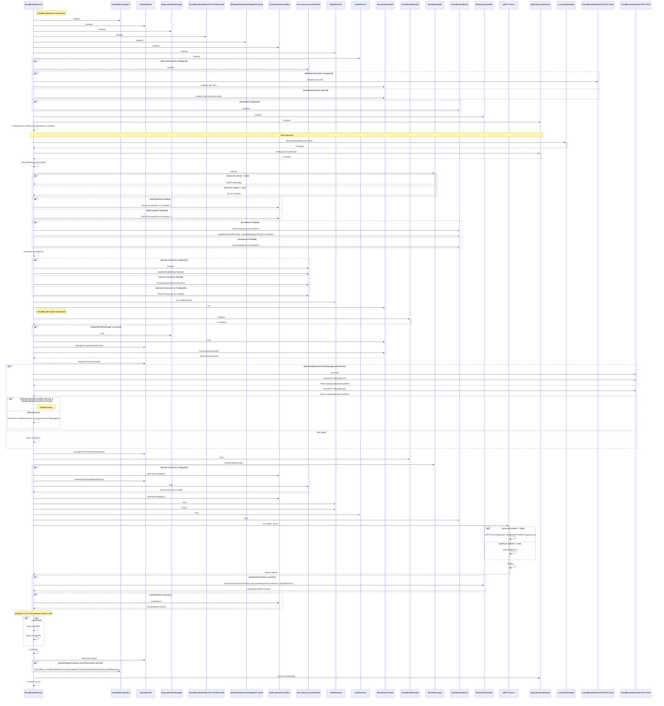

# Diagram Explanation and Key Payloads

## Initialization

- **CloudBoardDaemon** initializes various components:
  - `CloudMetricsSystem`
  - `StatusMonitor`
  - `RequestFielderManager`
  - `CloudBoardJobHelperXPCClientProvider`
  - `JobHelperResponseDelegateProvider`
  - `HotPropertiesController`
  - `HealthMonitor`
  - `HealthServer`
  - `ServiceDiscoveryPublisher`
  - `AttestationProvider`
  - `HeartbeatPublisher`
  - `WorkloadController`
- Loads configurations from either a file or preferences.
- Metrics are initialized.
- **LaunchdJobHelper** cleans up existing jobs.
- **JobQuiescenceMonitor** starts the quiescence monitor.
- **IdentityManager** initializes based on the setting, either with a self-signed certificate or not.

## Service Address Resolution

- **CloudBoardDaemon** resolves the service address from the configuration.

## Service Discovery (Conditional)

- If service discovery is enabled:
  - **ServiceDiscoveryPublisher** is initialized and configured.
  - Starts to register and discover services.

## Attestation Provider

- If `AttestationProvider` is not provided to the initializer, it is created using `CloudBoardAttestationAPIXPCClient`.
- `AttestationProvider.run()` is called to start fetching attestations.
- The first attestation fetch is performed, and `StatusMonitor` waits until it is fetched.

## Key Validation

- If `blockHealthinessOnAuthSigningKeysPresence` is set to `true`:
  - The process tries to connect to `CloudBoardJobAuthAPIXPCClient` and fetch TGT and OTT signing keys.
  - If the keys are not retrieved, the process exits.

## CloudBoardProvider

- **CloudBoardProvider** is initialized to manage the gRPC interface and related resources.
- It is started to receive requests.

## Identity Management

- **IdentityManager** manages TLS certificates and refreshes them periodically.

## Health Monitoring

- **HealthProvider** and **HealthServer** are used for health checks.
- The health server starts listening to health events.

## Heartbeats (Conditional)

- If heartbeats are configured:
  - **HeartbeatPublisher** is initialized and starts publishing heartbeats.

## gRPC Server

- The gRPC server starts, using either TLS or insecure mode based on the configuration.
- The server binds to the specified service address and port.
- The method `GRPCTLSConfiguration.cloudboardProviderConfiguration()` is called to create the gRPC server configuration.

## Workload Controller (Conditional)

- If a **WorkloadController** is present, it starts running to manage cloud workload requests.

## Hot Properties (Conditional)

- If hot properties are used, it starts listening to property updates.

## Task Group and Error Handling

- All operations are launched within a `TaskGroup` to ensure clean system shutdown if any operation fails.
- `StatusMonitor` listens for any status changes.

## Drain and Quiescence

- On drain:
  - Providers initiate the drain process (e.g., `CloudBoardProvider`, `HealthMonitor`, `WorkloadController`).
- After drain:
  - **JobQuiescenceMonitor** waits for jobs to quiesce.
- A metric for `DrainCompletionTimeHistogram` is emitted to `CloudMetricsSystem`.
- The process can either end or continue.

---

## Payload Notes in the Diagram

1. **Configuration Data**:
   - Loading configuration details (from file or preferences) is the core payload in the initial steps.
2. **TLS Identity**:
   - **IdentityManager** loads or generates a TLS identity (certificate and private key), a crucial security payload.
3. **Keys Data**:
   - `requestTGTSigningKeys()`, `requestOTTSigningKeys()` return an array of signing keys.
4. **Attestation Data**:
   - `currentAttestationSet()` gets the attestation set.
5. **Metrics**:
   - **CloudMetricsSystem** receives events to trace the process.
6. **Hot Properties**:
   - Updates are handled through `HotPropertiesController`.

---

## Key Components

1. **CloudBoardDaemon**: The central orchestrator.
2. **CloudMetricsSystem**: Handles metric collection and reporting.
3. **StatusMonitor**: Tracks and publishes the status of the daemon.
4. **RequestFielderManager**: Manages a pool of processes for handling requests.
5. **CloudBoardJobHelperXPCClientProvider**: Provides clients for communicating with `cb_jobhelper`.
6. **JobHelperResponseDelegateProvider**: Manages response delegation.
7. **HotPropertiesController**: Handles dynamic configuration updates.
8. **ServiceDiscoveryPublisher**: Registers and discovers services.
9. **HealthMonitor**: Monitors the system's health.
10. **HealthServer**: Provides health check endpoints.
11. **AttestationProvider**: Fetches and manages attestations.
12. **CloudBoardProvider**: Handles gRPC requests and interacts with `cb_jobhelper`.
13. **IdentityManager**: Manages TLS identity.
14. **HeartbeatPublisher**: Publishes heartbeat messages.
15. **WorkloadController**: Manages workload requests.
16. **gRPC Server**: Handles incoming gRPC traffic.
17. **JobQuiescenceMonitor**: Tracks job quiescence.
18. **LaunchdJobHelper**: Cleans up old launchd jobs.
19. **CloudBoardAttestationAPIXPCClient**: Communicates with `cb_attestationd`.
20. **CloudBoardJobAuthAPIXPCClient**: Communicates with `cb_jobauthd`.

---

This sequence diagram and explanation should give a comprehensive understanding of how **CloudBoardDaemon** works. Let me know if you have any other questions.

