# CloudBoardJobHelper Component Overview

## Initialization

The **CloudBoardJobHelper** initializes several components upon its creation:

1. **Fetch Preferences Updates**: Retrieves updates for hot properties.
2. **CloudMetricsSystem**: Created for tracking and reporting metrics.
3. **Job UUID**: Fetches or generates a `jobUUID`.
4. **Signing Keys**: Connects to `CloudBoardJobAuthAPIClient` to retrieve signing keys.
5. **TokenGrantingTokenValidator**: Creates an instance for token validation.
6. **Key Update Delegate**: Sets a delegate for signing key updates.
7. **Stream Creation**: Initializes streams for requests and responses.
8. **Other Components**:
    - `CloudBoardMessenger`
    - `WorkloadJobManager`
    - `CloudAppResponseDelegate`
9. **Cloud App Workload**: Retrieves the Cloud App Workload instance.
10. **XPC Server**: Establishes a connection to the XPC Server.

---

## Cloud App Discovery

1. Uses `LaunchdJobHelper` to discover the appropriate Cloud App to manage.
2. Filters managed app jobs based on:
   - `cloudAppNameOverride`
   - Default configurations (if no override is provided).
3. Creates a `CloudBoardAppWorkload` for the discovered app.

---

## Main Processing Loop

The **CloudBoardJobHelper** employs a `withThrowingTaskGroup` to execute main tasks concurrently:

### Tasks:

1. **CloudBoardMessenger.run()**: 
   - Manages XPC connections.
   - Handles receiving and sending messages.

2. **WorkloadJobManager.run()**: 
   - Validates requests.
   - Manages the overall flow and routing of requests.

3. **CloudAppWorkload.run()**: 
   - Handles the processing for the actual Cloud App.

4. **cloudAppRequestStream Consumer**:
   - Processes the cloud app request stream.

---

## Request and Response Flow

### Request Flow:

1. **Requests** are received by `CloudBoardMessenger`.
2. Processed by **WorkloadJobManager**.
3. Forwarded through `cloudAppRequestStream` to **CloudAppWorkload**.

### Request Types:

- `.warmup`: Forwards warmup data to the Cloud App.
- `.parameters`: 
  - Forwards parameters to the Cloud App.
  - Ensures the `requestID` is set.
- `.chunk`: Forwards data chunks to the Cloud App.
- `.endOfInput`: Forwards the end-of-input signal to the Cloud App.
- `.teardown`: Forwards teardown signals to the Cloud App.
- `.oneTimeToken`: Unexpected type.

### Response Flow:

1. Responses from the Cloud App are handled by **CloudAppResponseDelegate**.
2. Data is placed onto the `cloudAppResponseStream`.

### Response Types:

- `.chunk`: Contains the payload data of the response.
- `.appTermination`: Status code, if provided, for app termination.

---

## Error Handling

1. If an error occurs within the task group:
   - All tasks are canceled.
   - Attempts are made to gracefully tear down the workload.
2. The error is then rethrown.

---

## Metrics Updates

- The `withMetricsUpdates` function runs periodically to update metrics (e.g., uptime).

---

## Cleanup

1. Upon task completion:
   - Invalidates the metrics system.
   - Logs the operation's end.

---

## Payloads

### Request Payloads:

- **Warmup Data**: Contains data associated with the `.warmup` request.
- **Parameters Data**:
  - Includes `plaintextMetadata.requestID`.
- **Chunk**: The payload for `.chunk`.
  
### Response Payloads:

- **Data**: The response payload.
- **AppTermination**: Includes a status code (if provided).

### Additional Payloads:

- **Signing Keys**:
  - `ottPublicSigningKeys`: Array of OTT signing keys.
  - `tgtPublicSigningKeys`: Array of TGT signing keys.
- **Preferences**: Managed by `CloudBoardJobHelperHotProperties`.

---

This document provides a comprehensive representation of the interaction between the components within `CloudBoardJobHelper.swift`, including internal flows and payload management.

```mermaid
sequenceDiagram
    participant CBJobHelper as CloudBoardJobHelper
    participant Preferences as PreferencesUpdates
    participant LaunchdJobHelper
    participant CBJobAuthAPIClient as CloudBoardJobAuthAPIClient
    participant TGTValidator as TokenGrantingTokenValidator
    participant CBMessenger as CloudBoardMessenger
    participant WorkloadManager as WorkloadJobManager
    participant CloudAppWorkload
    participant CloudAppResponseDelegate
    participant MetricsSystem
    participant CloudAppRequestStream
    participant XPCServer as CloudBoardJobHelperAPIXPCServer

    Note over CBJobHelper,Preferences: Initialization
    CBJobHelper->>Preferences: PreferencesUpdates(domain, duration, type)
    Preferences-->>CBJobHelper: preferencesUpdates instance
    CBJobHelper->>Preferences: try await preferencesUpdates.first()
    Preferences-->>CBJobHelper: preferences (CloudBoardJobHelperHotProperties)
    CBJobHelper->>MetricsSystem: CloudMetricsSystem(clientName)
    MetricsSystem-->>CBJobHelper: metrics instance
    Note over CBJobHelper: Fetch & update job UUID
    CBJobHelper->>LaunchdJobHelper: LaunchdJobHelper.currentJobUUID(logger)
    alt UUID found
        LaunchdJobHelper-->>CBJobHelper: jobUUID
    else UUID not found
        LaunchdJobHelper-->>CBJobHelper: nil
        CBJobHelper-->>CBJobHelper: new UUID()
    end
    Note over CBJobHelper,CBJobAuthAPIClient: Setup cb_jobauthd interaction
    CBJobHelper->>CBJobAuthAPIClient: CloudBoardJobAuthAPIXPCClient.localConnection()
    CBJobAuthAPIClient-->>CBJobHelper: jobAuthClient instance
    CBJobHelper->>CBJobAuthAPIClient: connect()
    CBJobHelper->>CBJobAuthAPIClient: requestOTTSigningKeys()
    Note right of CBJobAuthAPIClient: Return type: [SecKey]
    CBJobAuthAPIClient-->>CBJobHelper: ottPublicSigningKeys
    CBJobHelper->>CBJobAuthAPIClient: requestTGTSigningKeys()
    Note right of CBJobAuthAPIClient: Return type: [SecKey]
    CBJobAuthAPIClient-->>CBJobHelper: tgtPublicSigningKeys
    CBJobHelper->>TGTValidator: TokenGrantingTokenValidator(signingKeys)
    TGTValidator-->>CBJobHelper: tgtValidator instance
    CBJobHelper->>CBJobAuthAPIClient:set(delegate)
    Note right of CBJobAuthAPIClient: Delegate : JobAuthClientDelegate
    CBJobAuthAPIClient-->>CBJobHelper: OK
    
    Note over CBJobHelper, CBMessenger: Stream Creation
    CBJobHelper->>CBJobHelper: Create AsyncStreams for request/response
    CBJobHelper->>CBJobHelper: Create AsyncThrowingStream for cloud app response
    Note right of CBJobHelper: (wrappedRequestStream, wrappedRequestContinuation)
    Note right of CBJobHelper: (wrappedResponseStream, wrappedResponseContinuation)
    Note right of CBJobHelper: (cloudAppRequestStream, cloudAppRequestContinuation)
    Note right of CBJobHelper: (cloudAppResponseStream, cloudAppResponseContinuation)
    
    Note over CBJobHelper, CBMessenger: CloudBoardMessenger creation
    CBJobHelper->>CBMessenger: CloudBoardMessenger(attestationClient, server, encodedRequestContinuation, responseStream, metrics)
    CBMessenger-->>CBJobHelper: cloudBoardMessenger instance

    Note over CBJobHelper, WorkloadManager: WorkloadJobManager Creation
    CBJobHelper->>WorkloadManager: WorkloadJobManager(tgtValidator, enforceTGTValidation, wrappedRequestStream, maxRequestMessageSize, wrappedResponseContinuation, cloudAppRequestContinuation, cloudAppResponseStream, cloudAppResponseContinuation, metrics, jobUUID)
    WorkloadManager-->>CBJobHelper: workloadJobManager instance
    
    Note over CBJobHelper, CloudAppResponseDelegate: CloudAppResponseDelegate Creation
    CBJobHelper->>CloudAppResponseDelegate: CloudAppResponseDelegate(responseContinuation)
    CloudAppResponseDelegate-->>CBJobHelper: cloudAppResponseDelegate instance

    Note over CBJobHelper, LaunchdJobHelper: Fetch managed CloudApp
    CBJobHelper->>LaunchdJobHelper: fetchManagedLaunchdJobs(type, skippingInstances, logger)
    alt CloudApp Found
        LaunchdJobHelper-->>CBJobHelper: [ManagedLaunchdJob]
        CBJobHelper->>CBJobHelper: filter CloudApp Job by `cloudAppNameOverride` or default
        CBJobHelper->>CloudAppWorkload: CloudBoardAppWorkload(managedJob, machServiceName, log, delegate, metrics, jobUUID)
        CloudAppWorkload-->>CBJobHelper: cloudAppWorkload instance
    else No CloudApp
        LaunchdJobHelper-->>CBJobHelper: []
        CBJobHelper-->>CBJobHelper: fatalError("Failed to discover any managed CloudApps")
    end

    Note over CBJobHelper, XPCServer: Setup and connect XPC
    CBJobHelper->>XPCServer: set(delegate)
    Note right of XPCServer: Delegate is CloudBoardMessenger
    XPCServer-->>CBJobHelper: OK
    CBJobHelper->>XPCServer: connect()
    XPCServer-->>CBJobHelper: OK

    Note over CBJobHelper: Main Processing Loop
    CBJobHelper->>CBJobHelper: withMetricsUpdates()
    CBJobHelper->>CBJobHelper: withThrowingTaskGroup()
    
    Note over CBJobHelper: Start Tasks in Task Group
    CBJobHelper->>CBMessenger: run()
    Note over CBJobHelper: CloudBoardMessenger starts handling XPC connections and messages
    CBJobHelper->>WorkloadManager: run()
    Note over CBJobHelper: WorkloadJobManager manages TGT validation and request handling
    CBJobHelper->>CloudAppWorkload: run()
    Note over CBJobHelper: CloudAppWorkload starts managing the cloud app
    CBJobHelper->>CloudAppRequestStream: for try await request in cloudAppRequestStream
    Note over CBJobHelper, CloudAppRequestStream: Processing incoming Cloud App requests
    alt request is .warmup
        CloudAppRequestStream-->>CBJobHelper: .warmup(warmupData)
        CBJobHelper->>CloudAppWorkload: warmup(warmupData)
        Note over CloudAppWorkload: Forward warmup
        CloudAppWorkload-->>CBJobHelper: OK
    else request is .parameters
        CloudAppRequestStream-->>CBJobHelper: .parameters(parametersData)
        Note right of CBJobHelper: parametersData: `plaintextMetadata.requestID` 
        CBJobHelper->>CBJobHelper: setRequestID(requestID)
        CBJobHelper->>CloudAppWorkload: parameters(parametersData)
        Note over CloudAppWorkload: Forward parameters
        CloudAppWorkload-->>CBJobHelper: OK
    else request is .chunk
        CloudAppRequestStream-->>CBJobHelper: .chunk(chunk)
        CBJobHelper->>CloudAppWorkload: provideInput(chunk.chunk, isFinal: chunk.isFinal)
        Note over CloudAppWorkload: Forward data chunk
        CloudAppWorkload-->>CBJobHelper: OK
    else request is .endOfInput
        CloudAppRequestStream-->>CBJobHelper: .endOfInput
        CBJobHelper->>CloudAppWorkload: endOfInput()
        Note over CloudAppWorkload: Forward end of input signal
        CloudAppWorkload-->>CBJobHelper: OK
    else request is .teardown
        CloudAppRequestStream-->>CBJobHelper: .teardown
        CBJobHelper->>CloudAppWorkload: teardown()
        Note over CloudAppWorkload: Forward teardown
        CloudAppWorkload-->>CBJobHelper: OK
     else request is .oneTimeToken
        CloudAppRequestStream-->>CBJobHelper: .oneTimeToken
        Note over CloudAppWorkload: unexpected, ignore
     end

    
    Note over CloudAppWorkload: Handling response from the cloud App
    CloudAppWorkload->>CloudAppResponseDelegate: provideResponseChunk(data)
    Note right of CloudAppResponseDelegate: data is a chunk
    CloudAppResponseDelegate->>CloudAppResponseStream: yield(.chunk(data))
    CloudAppWorkload->>CloudAppResponseDelegate: endJob()
    Note right of CloudAppResponseDelegate: terminate response stream
    CloudAppResponseDelegate->>CloudAppResponseStream: finish()
    CloudAppWorkload->>CloudAppResponseDelegate: cloudBoardJobAPIClientAppTerminated(statusCode: Int?)
    CloudAppResponseDelegate->>CloudAppResponseStream: yield(.appTermination(.init(statusCode: statusCode)))

    
    Note over CBJobHelper: Error Handling
    alt Error during TaskGroup or CloudApp communication
        CBJobHelper-->>CBJobHelper: catch(error)
        CBJobHelper->>CloudAppWorkload: teardown()
        Note over CloudAppWorkload: Attempt to tear down workload
        CloudAppWorkload-->>CBJobHelper: OK
        CBJobHelper-->>CBJobHelper: throw error
    end
    CBJobHelper->>MetricsSystem: emit(Metrics.Daemon.ErrorExitCounter)
    CBJobHelper-->>CBJobHelper: emitLaunchMetrics()
    CBJobHelper-->>CBJobHelper: updateMetrics()
    CBJobHelper-->>CBJobHelper:  CloudboardJobHelperCheckpoint (log end)


```

