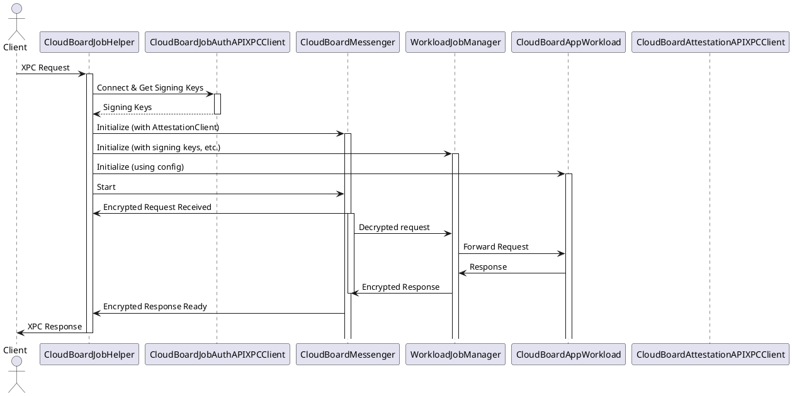
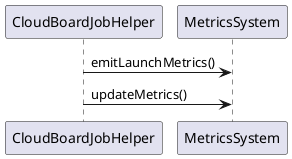

# CloudBoardJobHelper

CloudBoardD: This is the main daemon. It receives the initial job request (via gRPC), performs initial authentication and authorization, and then forwards the request to CloudBoardJobHelper. It also handles the response from CloudBoardJobHelper and sends it back to the client.

CloudBoardJobHelper: This daemon is the central component responsible for job execution. It receives the job request from CloudBoardD (likely via XPC), performs more detailed authentication and authorization (using keys from CloudBoardJobAuthD and attestations from CloudBoardAttestationD), and then uses a WorkloadJobManager to handle the job. CloudBoardJobHelper uses CloudBoardAppWorkload to interact with launchd (the macOS system service manager) to execute the actual workload.

CloudBoardAppWorkload: This actor within CloudBoardJobHelper manages the execution of the workload as a separate process. It uses ManagedLaunchdJobInstance to interact with launchd to start and monitor the process, handle data streams to and from the workload, and manage its lifecycle.

Workload: This is the actual workload process (a separate executable or daemon) that performs the actual work. CloudBoardAppWorkload starts, monitors, and interacts with the Workload process.

In short: CloudBoardD receives the request, performs initial checks and forwards it to CloudBoardJobHelper. CloudBoardJobHelper, after additional security validations, utilizes CloudBoardAppWorkload to start and monitor the Workload process which performs the actual work. The response then flows back through these components to the client.

Other components such as CloudBoardJobAuthD and CloudBoardAttestationD play a crucial role in the security aspects (authentication and attestation), but they are not directly involved in the execution of the job. The transparency log service is involved in recording the actions.


## Project Context: CloudBoard and the Apple Private Cloud Compute (PCC)

### Key Details:
- **Project Name**: CloudBoard
- **Project Location**: Likely part of a larger repository named `security-pcc` (Security - Private Cloud Compute).
- **Purpose**: CloudBoard is a key component of Apple's Private Cloud Compute infrastructure, designed to handle sensitive computations in a secure and isolated environment, possibly on Apple's cloud servers.
- **Core Function**: The `CloudBoardJobHelper` facilitates communication between clients and cloud applications within the PCC ecosystem.
- **CloudBoardJobHelperCore**: Handles the business logic of `CloudBoardJobHelper`.

### Frameworks:
- **AppServerSupport.OSLaunchdJob**: Manages launchd jobs (system services).
- **CloudBoardAsyncXPC**: Handles asynchronous communication using XPC (Inter-Process Communication).
- **CloudBoardAttestationDAPI**: Interacts with the Attestation service for security verification.
- **CloudBoardCommon**: Shared code and utilities.
- **CloudBoardJobAPI**: Defines the API for cloud jobs.
- **CloudBoardJobAuthDAPI**: Handles authentication and authorization for cloud jobs.
- **CloudBoardJobHelperAPI**: Defines the API for `CloudBoardJobHelper`.
- **CloudBoardMetrics**: Collects and emits performance and operational metrics.
- **CloudBoardPreferences**: Manages application preferences.

## File: CloudBoardJobHelper.swift

### 1. Copyright and License Header
- Specifies that the code is proprietary to Apple Inc. and for internal use only.
- Details terms of a restrictive license, allowing limited use for security and privacy verification.

### 2. Imports
```swift
import AppServerSupport.OSLaunchdJob
import CloudBoardAsyncXPC
import CloudBoardAttestationDAPI
import CloudBoardCommon
import CloudBoardJobAPI
import CloudBoardJobAuthDAPI
import CloudBoardJobHelperAPI
import CloudBoardMetrics
import CloudBoardPreferences
import Foundation
import os
```
- **os**: Provides logging functionalities.

### 3. CloudBoardJobHelperError
```swift
enum CloudBoardJobHelperError: Error {
    case unableToFindCloudAppToManage
}
```
- Custom error type specific to `CloudBoardJobHelper`.
- **Case**: `unableToFindCloudAppToManage` indicates that a suitable cloud application couldn’t be located.

### 4. CloudBoardJobHelperHotProperties
```swift
struct CloudBoardJobHelperHotProperties: Decodable, Hashable {
    private enum CodingKeys: String, CodingKey {
        case _maxRequestMessageSize = "MaxRequestMessageSize"
    }

    private var _maxRequestMessageSize: Int?
    var maxRequestMessageSize: Int {
        self._maxRequestMessageSize ?? 1024 * 1024 * 4 // 4MB
    }
}
```
- Defines configuration parameters for the helper.
- **maxRequestMessageSize**: Defaults to 4MB if not specified.

### 5. CloudBoardJobHelper - Core Class
```swift
public actor CloudBoardJobHelper {
    static let metricsClientName = "cb_jobhelper"

    let server: CloudBoardJobHelperAPIServerProtocol
    let attestationClient: CloudBoardAttestationAPIClientProtocol?
    let jobAuthClient: CloudBoardJobAuthAPIClientProtocol?
    let metrics: any MetricsSystem
    var requestID: String
    var jobUUID: UUID

    public static let logger: Logger = .init(
        subsystem: "com.apple.cloudos.cloudboard",
        category: "cb_jobhelper"
    )

    // ... (initializers and methods)
}
```
- **actor**: Provides concurrency safety.
- **Properties**:
  - **server**: Handles XPC communication.
  - **attestationClient**: Optional, used for security verification.
  - **jobAuthClient**: Optional, handles authentication.
  - **metrics**: Tracks performance.
  - **logger**: For logging.

### 6. Default Initializer
```swift
public init() {
    self.server = CloudBoardJobHelperAPIXPCServer.localListener()
    self.attestationClient = nil
    self.jobAuthClient = nil
    self.metrics = CloudMetricsSystem(clientName: Self.metricsClientName)
    self.requestID = ""

    let myUUID = LaunchdJobHelper.currentJobUUID(logger: Self.logger)
    if myUUID == nil {
        Self.logger.warning("Could not get own job UUID, creating new UUID for app")
    }
    self.jobUUID = myUUID ?? UUID()
}
```
- Sets up the XPC server, metrics, and UUID management.

### 7. Test Initializer
```swift
internal init(
    server: CloudBoardJobHelperAPIServerProtocol,
    attestationClient: CloudBoardAttestationAPIClientProtocol,
    jobAuthClient: CloudBoardJobAuthAPIClientProtocol,
    metrics: any MetricsSystem
) {
    // ... (body)
}
```
- Used for dependency injection during testing.

### 8. emitLaunchMetrics
```swift
private func emitLaunchMetrics() {
    self.metrics.emit(Metrics.Daemon.LaunchCounter(action: .increment))
}
```
- Increments the launch counter metric.

### 9. updateMetrics
```swift
private func updateMetrics(startInstant: ContinuousClock.Instant) {
    let uptime = Int(clamping: startInstant.duration(to: .now).components.seconds)
    self.metrics.emit(Metrics.Daemon.UptimeGauge(value: uptime))
}
```
- Reports process uptime as a metric.

### 10. setRequestID
```swift
private func setRequestID(_ requestID: String) {
    self.requestID = requestID
}
```
- Updates the request ID.

### 11. start() - Main Orchestration Method
```swift
public func start() async throws {
    // ... (body)
}
```
- Orchestrates the entire process lifecycle.
- **Preferences**:
  - Manages updates to preferences.
  - Loads configuration via `CBJobHelperConfiguration.fromPreferences()`.
- **Streams**:
  - Handles encrypted communication for requests and responses.
- **Job Authentication**:
  - Connects to the authentication service and fetches signing keys.

## Sequence Diagrams

### Overview of Interactions


### Metrics Flow

